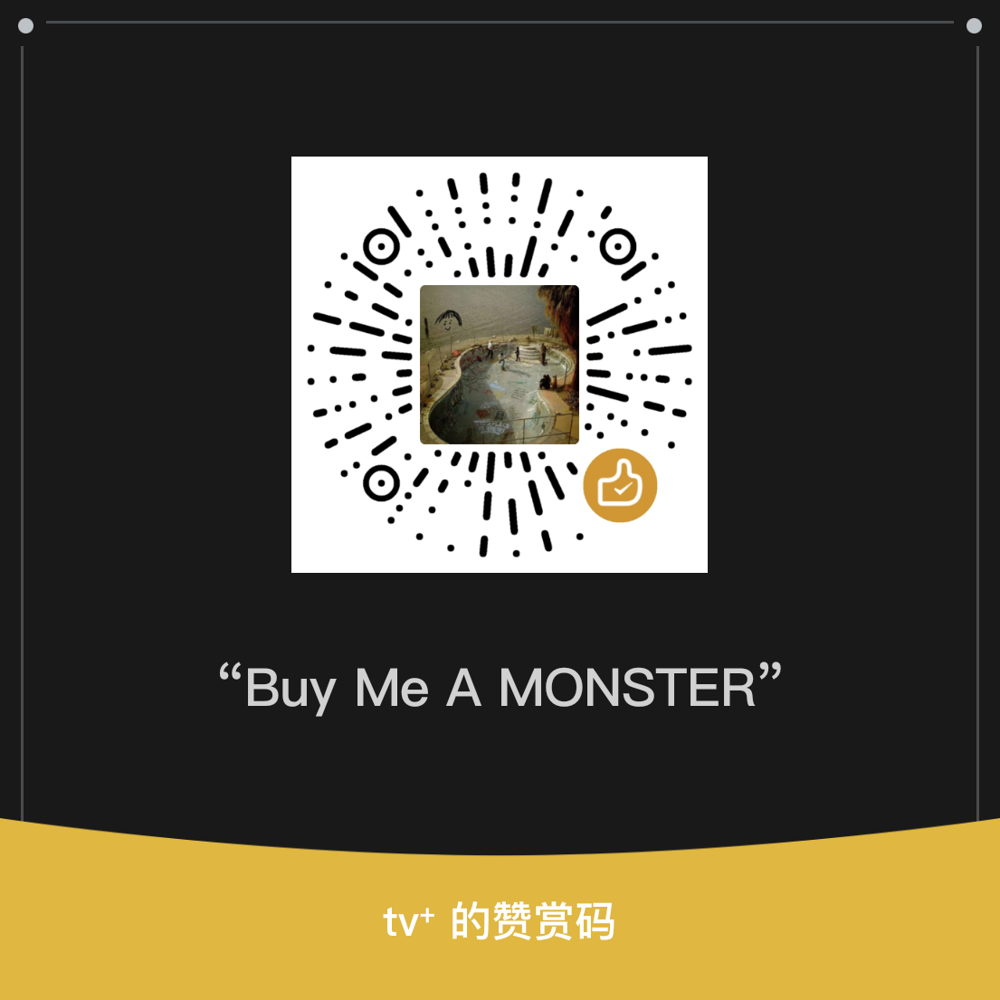

# CustoMIUIzer A14

[简体中文](README.md) | English

CustoMIUIzer A14 is a system UI and interaction customization module maintained for **HyperOS 1 / Android 14 (SDK 34)**. It has an independent package and release line and is not an official upstream release.

- Current release: `r14.20.6`
- Application ID: `tv.withaibuild.customiuizer.r14`
- Source: <https://github.com/tomthenpc/customiuizer-a14>
- User downloads: <https://github.com/Xposed-Modules-Repo/tv.withaibuild.customiuizer.r14/releases>

## Core Features

- Status bar icons, battery, signal, network speed, date, and temperature;
- Status capsule / Dynamic Island, USB default purpose, volume, and brightness;
- Control center, notifications, lock screen, charging, and media UI;
- Launcher, recents, folders, icons, and home-screen gestures;
- Navigation bar, buttons, custom actions, power menu, and system animations;
- App, permission, installer, sharing, privacy-app, and app-lock behavior.

Availability depends on the device ROM and system-app versions. Do not enable this module together with upstream or another CustoMIUIzer-derived module.

## Compatibility

| Item | Supported range |
| --- | --- |
| System | HyperOS 1 / Android 14 |
| SDK | minSdk 34 / targetSdk 34 |
| ABI | `arm64-v8a` |
| Xposed framework | libxposed API 101/102 |
| Module metadata | `minApiVersion=101`, `targetApiVersion=102`, `staticScope=true` |

Android 15, Android 16, and other major MIUI / HyperOS versions are not supported. API 102 capabilities remain isolated from production Hook paths required on API 101.

## Runtime Framework

- Features are installed lazily by target process and preference state; disabled features do not create business Hooks, Receivers, Observers, or tasks.
- Stable process-local feature IDs and install-once state prevent preference updates from reinstalling Hooks.
- Receiver, Observer, View, and controller registrations are owner-bound and have replacement, stale-state, and release paths.
- Reflection caches are bounded and isolated by ClassLoader; reflection, DexKit, and disk I/O stay on cold paths.
- Hook and callback boundaries isolate ordinary failures while `OutOfMemoryError`, `ThreadDeath`, and `VirtualMachineError` continue to propagate.
- Module-load logs and build provenance include the version and Git revision for exact build identification.

See [ARCHITECTURE.md](ARCHITECTURE.md) and [COMPATIBILITY.md](COMPATIBILITY.md) for architecture and compatibility boundaries.

## Build and Verification

```bash
python tools/verify.py full
```

See [DEVELOPMENT.md](docs/DEVELOPMENT.md) and [RELEASE.md](docs/RELEASE.md) for the complete workflow.

## Support and Contact

If this project is useful to you, you can support its continued development and maintenance via WeChat or [PayPal](https://paypal.me/Jinjitv).



- Repository: <https://github.com/tomthenpc/customiuizer-a14>
- Contact (Telegram): <https://t.me/Jinji_Kiko>

## Development Notes

- Stability and behavior preservation come first; compatibility logic stays at ROM and ClassLoader boundaries.
- Frequent Hooks avoid temporary arrays, collections, Regex, formatting, repeated reflection, and remote preference reads.
- Java-to-Kotlin migration remains behavior-equivalent and is paired with tests and static gates.
- `MainModule.java`, `XposedHelpers.java`, and `MemberUtilsX.java` remain as JVM/framework boundaries.
- Fine-grained history is available in Git commits and tags; release changes are in [CHANGELOG.md](CHANGELOG.md).

Distributed under GPL-3.0. Derived from Mikanoshi/CustoMIUIzer with Android 14 work referenced from MonwF/customiuizer.
